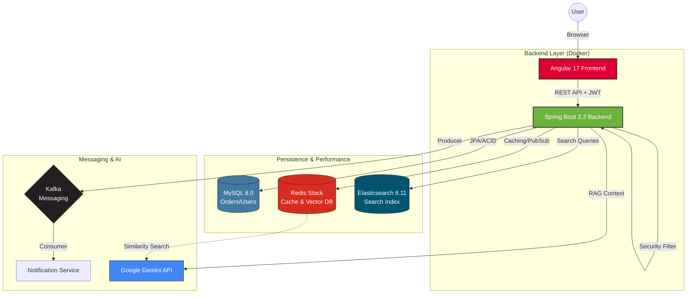

# System Architecture & User Flow

This diagram illustrates the high-level architecture and data flow of the SuperDuperMart E-Commerce Platform.

## Key Technical highlights
- **Angular 17**: Modular, lazy-loaded frontend.
- **Spring Boot 3.2**: Stateless REST API with JWT security.
- **RAG (Retrieval-Augmented Generation)**: Using Google Gemini and Redis Vector Store.
- **Elasticsearch**: High-performance search indexing.
- **Kafka**: Asynchronous event-driven order notifications.
- **Redis Stack**: Distributed caching and vector calculations.
