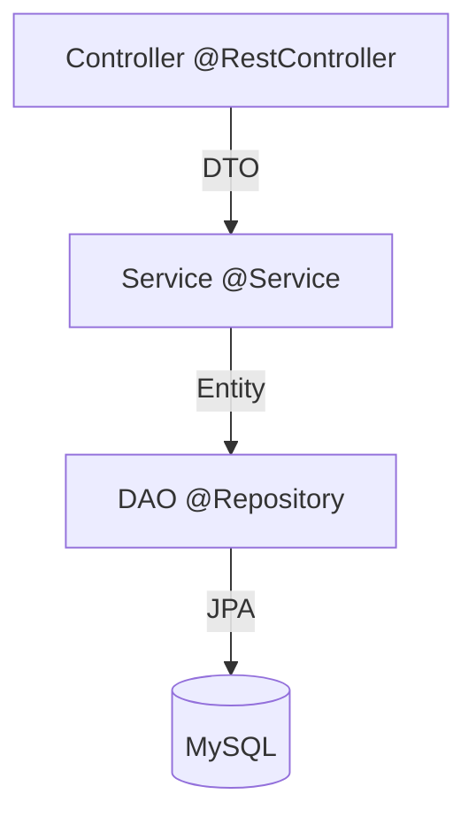

# Technical Deep Dive: Code Snippets & Explanations

Use these snippets to explain *how* you implemented the core features.

## 1. AI RAG Pipeline: Vector Indexing & Hybrid Redis
[RagService.java](file:///d:/00_Projects/e-commerce-demo/backend/src/main/java/com/superdupermart/shopping/service/RagService.java) / [VectorStoreConfig.java](file:///d:/00_Projects/e-commerce-demo/backend/src/main/java/com/superdupermart/shopping/config/VectorStoreConfig.java)

```java
// Logic inside VectorStoreConfig.java
@Bean
public VectorStore vectorStore(EmbeddingClient embeddingClient) {
    var config = RedisVectorStoreConfig.builder()
            .withIndexName("product_vectors")
            .withURI("redis://localhost:6379")
            .build();
    return new RedisVectorStore(config, embeddingClient);
}
```
- **Interview Script**: "I'm using **Redis** as a hybrid storage engine. Not only is it used for standard API caching (Section 3), but I also leveraged it as a **Vector Database** using Spring AI's `RedisVectorStore`. This allowed me to keep the infrastructure footprint small while getting high-performance semantic search capabilities for the RAG chatbot."

---

## 2. Resilience: Exponential Backoff for AI
[GeminiServiceImpl.java](file:///d:/00_Projects/e-commerce-demo/backend/src/main/java/com/superdupermart/shopping/service/impl/GeminiServiceImpl.java)

```java
// Logic to handle 429 Too Many Requests
while (retryCount <= maxRetries) {
    try {
        // ... call Gemini API ...
    } catch (Exception e) {
        if (e.getMessage().contains("429")) {
            Thread.sleep(backoffMs);
            backoffMs *= 2; // Exponential Backoff
            retryCount++;
            continue;
        }
    }
}
```
- **Interview Script**: "Handling 3rd-party APIs like Gemini requires resilience. I implemented a **retry mechanism with exponential backoff**. Specifically, if we hit a `429 Too Many Requests` status, the system waits (starting at 2s) and doubles the wait time for each subsequent retry. This prevents 'thundering herd' issues and ensures a smoother user experience."

---

## 3. High Performance: Redis Caching & ES Sync
[ProductServiceImpl.java](file:///d:/00_Projects/e-commerce-demo/backend/src/main/java/com/superdupermart/shopping/service/impl/ProductServiceImpl.java)

```java
@Cacheable(value = "products", key = "#isAdmin")
public List<ProductResponse> getAllProducts(boolean isAdmin) {
    // Fetches from DB only if Redis cache is empty
    return productDao.getAllProducts();
}

@Transactional
@CacheEvict(value = { "products", "product", "product_search" }, allEntries = true)
public ProductResponse updateProduct(Integer id, ProductRequest request) {
    productDao.update(product);    // MySQL
    saveToElasticsearch(product);   // Sync to ES
    return mapToResponse(product, true); // Redis cache is cleared via @CacheEvict
}
```
- **Interview Script**: "I use a layered caching strategy. Standard lookups are cached in **Redis** via Spring's `@Cacheable`. To prevent stale data, I use `@CacheEvict` which invalidates the cache globally whenever an update occurs. This ensures that the high performance of Redis doesn't compromise data accuracy."

---

## 4. Advanced Discovery: Elasticsearch Mapping
[ProductDocument.java](file:///d:/00_Projects/e-commerce-demo/backend/src/main/java/com/superdupermart/shopping/document/ProductDocument.java) / [ProductSearchRepository.java](file:///d:/00_Projects/e-commerce-demo/backend/src/main/java/com/superdupermart/shopping/repository/ProductSearchRepository.java)

```java
@Document(indexName = "products")
public class ProductDocument {
    @Id
    private Integer id;

    @Field(type = FieldType.Text, analyzer = "standard")
    private String name;

    @Field(type = FieldType.Auto)
    private BigDecimal price;
}
```
- **Interview Script**: "For Elasticsearch, I explicitly defined the **Document Mapping** to optimize for search. By using the `Text` field type with the `standard` analyzer on the product names, Lucene can perform partial matches and relevance scoring. This is why our search feels much 'smarter' than a basic SQL query."

---

## 5. Event-Driven Messaging: Kafka (Producer & Consumer)
[OrderServiceImpl.java](file:///d:/00_Projects/e-commerce-demo/backend/src/main/java/com/superdupermart/shopping/service/impl/OrderServiceImpl.java) / [NotificationService.java](file:///d:/00_Projects/e-commerce-demo/backend/src/main/java/com/superdupermart/shopping/service/NotificationService.java)

- **Producer**: `kafkaTemplate.send("orders", message);`
- **Consumer**: 
```java
@KafkaListener(topics = "orders", groupId = "shopping-group")
public void listen(String message) {
    logger.info("Received order event: " + message);
}
```
- **Interview Script**: "I implemented an end-to-end **event-driven workflow**. When an order is placed, the `OrderService` acts as a **Producer**, sending an event to the 'orders' topic. The `NotificationService` acts as a **Consumer**, listening for those events. This decoupling allows us to scale the notification system independently."

---

## 6. Transaction Atomicity
[OrderServiceImpl.java](file:///d:/00_Projects/e-commerce-demo/backend/src/main/java/com/superdupermart/shopping/service/impl/OrderServiceImpl.java)

```java
@Transactional
public OrderResponse placeOrder(Integer userId, OrderRequest request) {
    // 1. Deduct Inventory
    // 2. Authorize Payment
    // 3. Save Order
    // If any step fails, everything above ROLLS BACK.
}
```
- **Interview Script**: "Data consistency is paramount during checkout. I used Spring's `@Transactional` to ensure **atomic operations**. If the payment authorization fails, Spring automatically rolls back the inventory deduction, ensuring we never have 'phantom stock' issues."

---

## 7. Security Architecture: The Filter Chain
[SecurityConfig.java](file:///d:/00_Projects/e-commerce-demo/backend/src/main/java/com/superdupermart/shopping/security/SecurityConfig.java)

```java
@Bean
public SecurityFilterChain filterChain(HttpSecurity http) throws Exception {
    http
        .cors(...) // 1. Handle cross-origin requests
        .csrf(csrf -> csrf.disable()) // 2. Disable CSRF for stateless APIs
        .sessionManagement(s -> s.sessionCreationPolicy(SessionCreationPolicy.STATELESS)) // 3. No server-side sessions
        .authorizeHttpRequests(auth -> auth
            .requestMatchers("/admin/**").hasAuthority("ROLE_ADMIN") // 4. Define RBAC rules
            .anyRequest().authenticated())
        .addFilterBefore(jwtFilter, UsernamePasswordAuthenticationFilter.class); // 5. Custom JWT Filter
    return http.build();
}
```
- **Interview Script**: "The `SecurityFilterChain` is the heart of our defense. I configured it to be **stateless** since we use JWTs. This improves scalability because the server doesn't need to track session IDs in memory. I also injected a custom `JwtFilter` *before* the standard authentication filter to intercept and validate tokens on every request."

---

## 8. Role-Based Access Control (RBAC): The Flow
[JwtFilter.java](file:///d:/00_Projects/e-commerce-demo/backend/src/main/java/com/superdupermart/shopping/security/JwtFilter.java) / [JwtProvider.java](file:///d:/00_Projects/e-commerce-demo/backend/src/main/java/com/superdupermart/shopping/security/JwtProvider.java)

```java
// Inside JwtFilter.java
Optional<AuthUserDetail> user = jwtProvider.resolveToken(request); // 1. Extract & Map roles
if (user.isPresent()) {
    var auth = new UsernamePasswordAuthenticationToken(user, null, user.getAuthorities());
    SecurityContextHolder.getContext().setAuthentication(auth); // 2. Authenticate locally
}
```
- **Interview Script**: "RBAC in this system is driven by the JWT. In the `JwtFilter`, we use a `JwtProvider` to decode the 'permissions' claim. We then map those to Spring Security's `GrantedAuthority` objects. Once the `SecurityContext` is populated, Spring automatically enforces the rules defined in `SecurityConfig`. This means adding a new restricted endpoint is as simple as adding a regex pattern to the filter chain."

---

## 9. Cross-Cutting Concerns: AOP Logging
[LoggingAspect.java](file:///d:/00_Projects/e-commerce-demo/backend/src/main/java/com/superdupermart/shopping/aop/LoggingAspect.java)

```java
@Around("execution(* com.superdupermart.shopping.controller.*.*(..))")
public Object logExecutionTime(ProceedingJoinPoint joinPoint) throws Throwable {
    long start = System.currentTimeMillis();
    Object proceed = joinPoint.proceed(); // Run the actual method
    long time = System.currentTimeMillis() - start;
    logger.info("Exiting {}.{}. Execution time: {} ms", className, methodName, time);
    return proceed;
}
```
- **Interview Script**: "Instead of cluttering every controller with timing logic, I used **Aspect-Oriented Programming (AOP)**. This aspect automatically wraps every controller method, capturing execution time and logging activity. It's a clean way to handle cross-cutting concerns without polluting the business logic."

---

## 10. System Architecture: Docker Orchestration
[docker-compose.yml](file:///d:/00_Projects/e-commerce-demo/docker-compose.yml)

```yaml
services:
  mysql: { ... }
  redis: { image: redis/redis-stack:latest }
  kafka: { ... }
  elasticsearch: { ... }
  backend:
    depends_on:
      mysql: { condition: service_healthy }
      redis: { condition: service_healthy }
```
- **Interview Script**: "The entire system is containerized for 'write once, run anywhere' consistency. I used **Docker Compose** as the orchestrator. Notice the `depends_on` with `healthcheck` conditions; this ensures the backend doesn't start until the database and cache are fully ready, preventing race conditions during startup. This is a production-hardened pattern for local development and CI/CD."

---

## 11. Robustness: Global Exception Handling
[GlobalExceptionHandler.java](file:///d:/00_Projects/e-commerce-demo/backend/src/main/java/com/superdupermart/shopping/exception/GlobalExceptionHandler.java)

```java
@ControllerAdvice
public class GlobalExceptionHandler {
    @ExceptionHandler(NotEnoughInventoryException.class)
    public ResponseEntity<Map<String, String>> handle(NotEnoughInventoryException e) {
        return new ResponseEntity<>(Map.of("message", e.getMessage()), HttpStatus.BAD_REQUEST);
    }
}
```
- **Interview Script**: "To provide a professional API experience, I used a **Global Exception Handler** with `@ControllerAdvice`. Instead of letting raw stack traces leak to the client, I intercept custom business exceptions (like `NotEnoughInventory`) and map them to clean JSON responses with appropriate HTTP status codes. This keeps the API predictable and secure."

---

## 12. Frontend: Modular Angular Architecture
[app-routing.module.ts](file:///d:/00_Projects/e-commerce-demo/frontend/src/app/app-routing.module.ts)

```typescript
const routes: Routes = [
  { path: 'admin', loadChildren: () => import('./admin/admin.module').then(m => m.AdminModule) },
  { path: 'user', loadChildren: () => import('./user/user.module').then(m => m.UserModule) }
];
```
- **Interview Script**: "For the frontend, I followed a **Lazy-Loaded Module** architecture in Angular. Notice how the Admin and User flows are separated. This keeps the initial bundle size small and improves the application's performance. I also used **HTTP Interceptors** to automatically attach the JWT token to every outgoing request, centralizing my auth logic."

---

## 13. Backend Architecture: Controller-Service-DAO
[OrderController.java](file:///d:/00_Projects/e-commerce-demo/backend/src/main/java/com/superdupermart/shopping/controller/OrderController.java) / [OrderServiceImpl.java](file:///d:/00_Projects/e-commerce-demo/backend/src/main/java/com/superdupermart/shopping/service/impl/OrderServiceImpl.java) / [OrderDaoImpl.java](file:///d:/00_Projects/e-commerce-demo/backend/src/main/java/com/superdupermart/shopping/dao/impl/OrderDaoImpl.java)


- **Interview Script**: "I followed a strict **Separation of Concerns**. The **Controller** handles HTTP semantics and user context (JWT). The **Service** layer contains all business logic—like inventory checks and payment validation—and manages the transaction boundary. The **DAO (Data Access Object)** layer is purely for database interaction. This makes the code highly testable; I can unit test the Service by mocking the DAO without ever touching a database."

---

## 14. Persistence Strategy: Plain JPA & EntityManager
[OrderDaoImpl.java](file:///d:/00_Projects/e-commerce-demo/backend/src/main/java/com/superdupermart/shopping/dao/impl/OrderDaoImpl.java)

```java
@Repository
public class OrderDaoImpl implements OrderDao {
    @PersistenceContext
    private EntityManager entityManager;

    public void save(Order order) {
        entityManager.persist(order); // Managed state
    }
}
```
- **Interview Script**: "Instead of just using Spring Data Repositories, I chose to implement the **DAO pattern with plain JPA and the EntityManager**. This allowed me to have more control over the **Persistence Context** and Hibernate session. Understanding the difference between `persist()` (new entity) and `merge()` (detached entity) is crucial for managing entity states and ensuring ACiD compliance in complex transaction chains."

---

## 15. Clean APIs: DTO vs. Entity Mapping
[OrderServiceImpl.java](file:///d:/00_Projects/e-commerce-demo/backend/src/main/java/com/superdupermart/shopping/service/impl/OrderServiceImpl.java)

```java
// Logic inside mapToResponse
private OrderResponse mapToResponse(Order order) {
    return OrderResponse.builder()
            .id(order.getId())
            .totalAmount(order.getTotalAmount())
            .build();
}
```
- **Interview Script**: "A key principle I followed is **never exposing Database Entities to the API**. I use **DTOs (Data Transfer Objects)** for all requests and responses. This decouples the API contract from the database schema. If I change the database table structure, I can just update the mapping logic in the Service layer without breaking the frontend or external API consumers."
