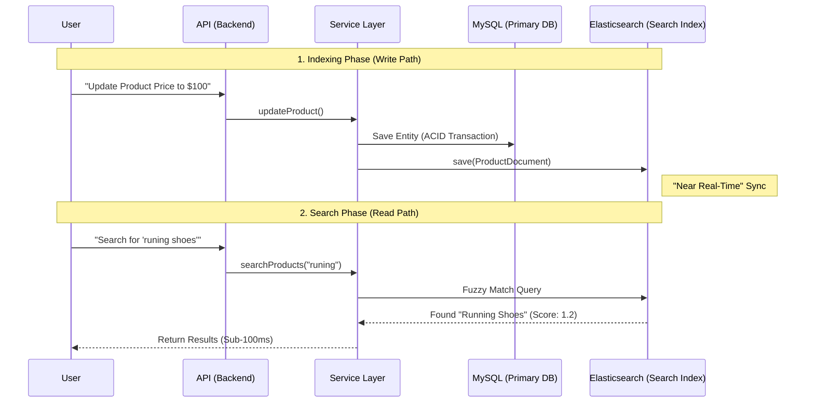

# Elasticsearch Workflow: Speed & Scale

**Elasticsearch** is your "Read Layer." While MySQL is the "Source of Truth" (strictly consistent), Elasticsearch is optimized for **fuzzy search, full-text queries, and speed**.

## 1. The High-Level Flow (Mermaid)

## 2. The Two Paths in Your Code

### Path 1: Indexing (Keeping Data in Sync)
**Where**: [`ProductServiceImpl.java`](../../backend/src/main/java/com/superdupermart/shopping/service/impl/ProductServiceImpl.java) -> `updateProduct()` / `createProduct()`
- **What happens**: 
    1. We save the product to **MySQL** first using JPA. This guarantees the data is safe.
    2. Immediately after, we transform the entity into a `ProductDocument` (a JSON-like object specialized for search).
    3. We save that document to **Elasticsearch**.
- **Talking Point**: "Currently, this is a **Dual Write** in the service layer. Ideally, for a distributed system, I would move this to an async **CDC (Change Data Capture)** pipeline using Kafka Connect to decouple the latency."

### Path 2: Searching (The Fast Lane)
**Where**: [`ProductServiceImpl.java`](../../backend/src/main/java/com/superdupermart/shopping/service/impl/ProductServiceImpl.java) -> `searchProducts()`
- **What happens**: 
    1. The user sends a query, maybe with typos ("runing").
    2. We use a **Native Query** or a `Repository` method to ask Elasticsearch.
    3. ES uses its **Inverted Index** to find documents containing those tokens instantly.
    4. We return the `ProductDocument` directly (we don't hit MySQL again).

## 3. Why is this "Senior" level?
- **Separation of Concerns**: You aren't forcing MySQL to do full-text search (which it's bad at).
- **Latency awareness**: You talk about "sub-100ms" response times.
- **Trade-off recognition**: You acknowledge that "Dual Write" is simple but has consistency risks, and you know the solution (CDC/Kafka) for the next level of scale.
