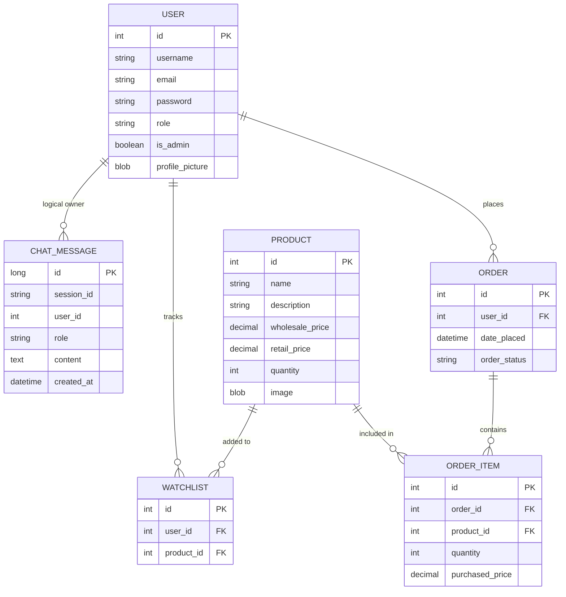

# Entity Relationship Diagram (ERD)

This diagram shows the relational schema of the SuperDuperMart E-Commerce Platform.

## Schema Highlights
- **User-Order (1:N)**: Standard relational link using JPA `@ManyToOne`.
- **Order-OrderItem (1:N)**: Uses `CascadeType.ALL` and `orphanRemoval=true` to manage items as part of the order lifecycle.
- **Product-OrderItem (1:N)**: Maintains referential integrity for purchased items. Note: `purchased_price` is stored in `OrderItem` to protect against future product price changes.
- **Watchlist (M:N via Join Table)**: Implemented as a separate entity to allow for additional metadata/tracking if needed.
- **ChatMessage**: Decoupled session-based storage with a logical link to `userId`.
