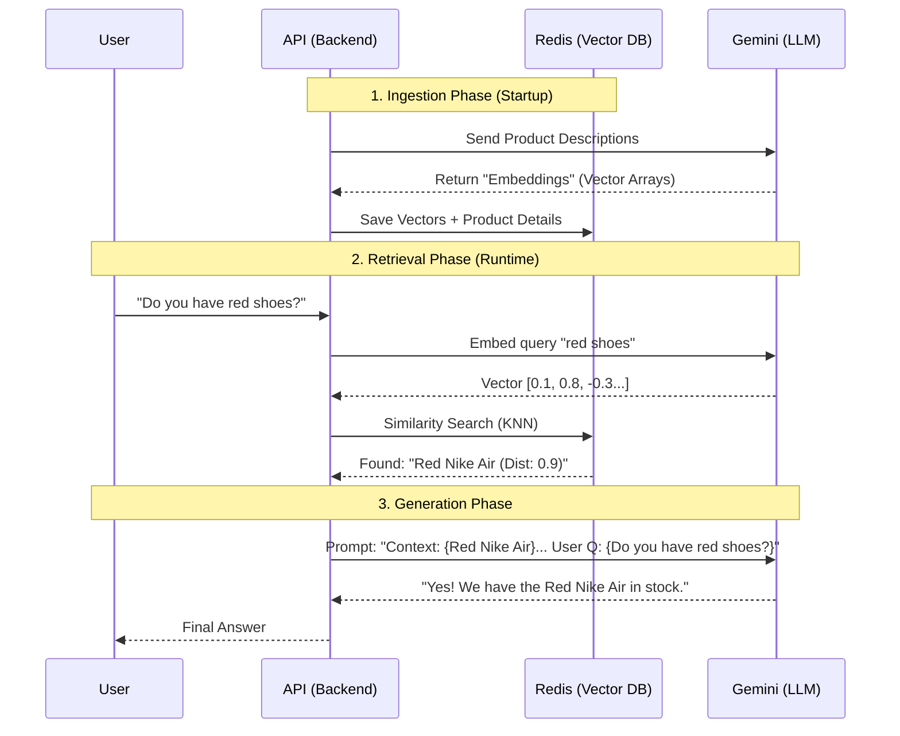

# RAG Workflow: The "Open Book" Exam

**RAG (Retrieval-Augmented Generation)** is like giving the AI a textbook before asking it a question. Instead of relying only on its training data (which might be old), we "retrieve" relevant, up-to-date info and "augment" the prompt with it.

## 1. The High-Level Flow (Mermaid)



## 2. The Three Steps in Your Code

### Step 1: Ingestion (The "Study" Phase)
**Where**: [`RagService.java`](../../backend/src/main/java/com/superdupermart/shopping/service/RagService.java) -> `@PostConstruct init()`
- **What happens**: When the app starts, we take every product in the DB, turn its description into a **Vector** (a list of numbers representing meaning), and store it in **Redis**.
- **Analogy**: Writing summaries of every book in the library on index cards.

### Step 2: Retrieval (The "Lookup" Phase)
**Where**: [`RagService.java`](../../backend/src/main/java/com/superdupermart/shopping/service/RagService.java) -> `generateResponse(String userQuery)`
- **What happens**: 
    1. User asks "Do you have gaming laptops?"
    2. We turn that question into a **Vector**.
    3. We ask Redis: "Find vectors mathematically close to this question vector."
- **Analogy**: A librarian looking up the index cards that match your request.

### Step 3: Augmentation & Generation (The "Answer" Phase)
**Where**: `chatClient.prompt().user(prompt)`
- **What happens**: We construct a massive prompt that looks like:
    ```text
    SYSTEM: You are a helpful assistant.
    CONTEXT: Found these products: [ASUS ROG, $1200], [Alienware, $1500]
    USER QUESTION: Do you have gaming laptops?
    ```
- **Analogy**: Handing the librarian the specific books and saying "Answer the user using ONLY these books."

## 3. Why is this "Senior" level?
- **Hybrid Redis**: You used existing infrastructure (Redis) instead of buying a new tool (Pinecone/Weaviate), saving money and complexity.
- **Context Window Management**: You only send relevant products to Gemini, saving token costs.
- **Freshness**: If you update a product in Redis, the AI immediately "knows" about it without retraining.
