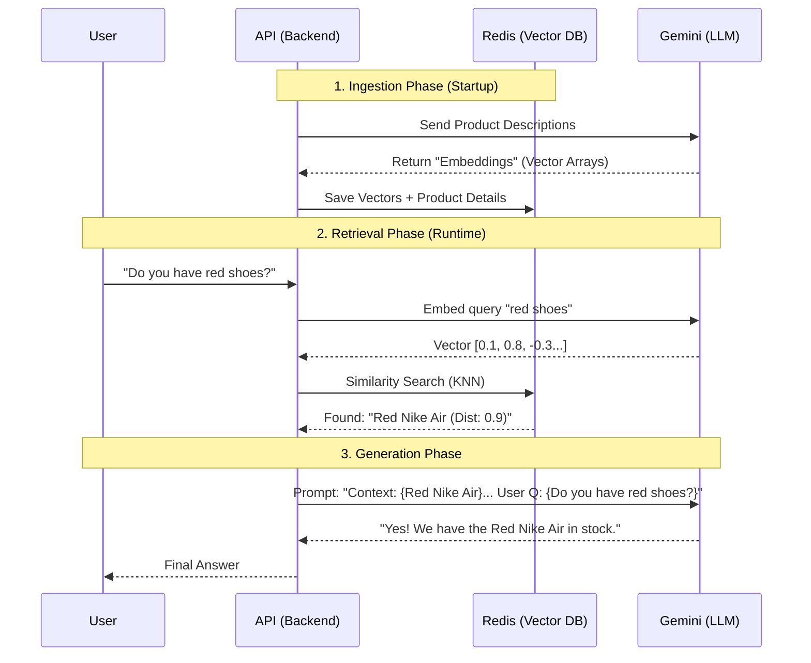
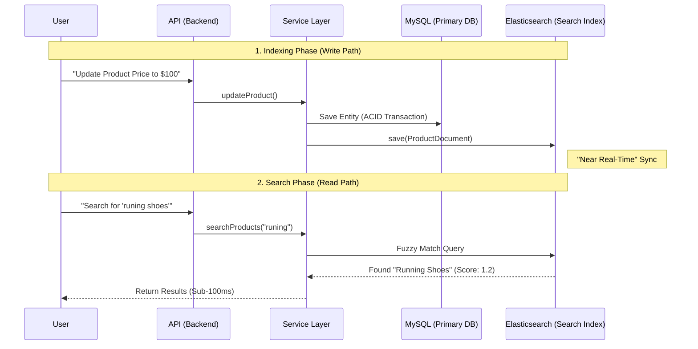

# Interview Walkthrough Guide for E-Commerce Demo

Use this guide to structure your project walkthrough. It focuses on high-impact technical decisions and "wow" features that demonstrate senior-level engineering skills.

## 🕒 1-Hour Interview Architecture
| Duration | Stage | Goal | Focus |
| :--- | :--- | :--- | :--- |
| **00-05 min** | Intro & Pitch | Set the context | Section 1: The Elevator Pitch |
| **05-15 min** | Product & UX | Show the 'What' | Dashboard, Chatbot Demo, ES Search |
| **15-40 min** | Technical Deep Dive | Show the 'How' | Section 2: Areas A, B, C, D |
| **40-50 min** | Ops & Infrastructure | Show the 'Scale' | Docker, Kafka, Caching strategy |
| **50-60 min** | Q&A / Review | Show the 'Expertise' | Section 4: Potential Questions |

## 1. The Elevator Pitch (30-60 Seconds)
"This is a full-stack e-commerce platform built with **Spring Boot 3.2** and **Angular 17**. My goal was to create a production-ready system that handles high concurrency and provides modern AI features. It features a **RAG-based product chatbot** using Google Gemini, optimized **Elasticsearch** for sub-100ms search latency, and a robust **Redis** caching layer. The infrastructure is fully containerized with **Docker** and leverages **Kafka** for asynchronous order processing."

## 🧩 System Architecture & User Flow


---

## 2. Technical Deep-Dives (Focus Areas)

### A. AI Integration: RAG-based Chatbot
**What it is**: An AI assistant that knows your product inventory.
#### The Workflow (Mermaid)

#### Key Code Steps
1. **Ingestion**: [`RagService.java`](../../backend/src/main/java/com/superdupermart/shopping/service/RagService.java) -> `@PostConstruct` loads products into Redis.
2. **Retrieval**: [`RagService.java`](../../backend/src/main/java/com/superdupermart/shopping/service/RagService.java) finds vectors mathematically close to the user query.
3. **Generation**: We inject those product details into the Gemini prompt context.

### B. High Performance: Elasticsearch & Redis
**What it is**: A dual-database strategy for speed and scale.
#### The Workflow (Mermaid)

#### Key Code Steps
1. **Indexing (Dual Write)**: [`ProductServiceImpl.java`](../../backend/src/main/java/com/superdupermart/shopping/service/impl/ProductServiceImpl.java) saves to MySQL *and* Elasticsearch.
   - *Senior Note*: "I'd move this to CDC (Kafka) for better resilience in a larger system."
2. **Searching**: [`ProductServiceImpl.java`](../../backend/src/main/java/com/superdupermart/shopping/service/impl/ProductServiceImpl.java) hits ES directly for sub-100ms fuzzy search.

### C. Scalability: Event-Driven Kafka
**What it is**: Decoupling order placement from notifications.
- **Talking Points**:
    - "When a user places an order, instead of sending emails synchronously (which is slow), I emit a **Kafka event**."
    - "This decouples the order success from the notification service, improving perceived latency for the user."

### D. Security: Stateless Authentication & RBAC
**What it is**: Secure, scalable user management without server-side sessions.
- **Implementation**: [SecurityConfig.java](../../backend/src/main/java/com/superdupermart/shopping/security/SecurityConfig.java) / [JwtFilter.java](../../backend/src/main/java/com/superdupermart/shopping/security/JwtFilter.java)
- **Talking Points**:
    - **Statelessness**: "I implemented **JWT authentication** to keep the backend stateless. This is critical for horizontal scaling, as any server instance can validate a request without sharing session state."
    - **RBAC Enforcement**: "Access is controlled via **Role-Based Access Control**. The `JwtFilter` extracts roles from the token, and the `SecurityFilterChain` enforces strict boundaries—for example, only users with `ROLE_ADMIN` can access inventory management."
    - **Security Pipeline**: "The entire security flow is a pipeline. Every request is intercepted, validated, and authorized before it ever touches a Controller."

### E. Infrastructure: Full Stack Orchestration
**What it is**: 6+ services running in harmony via Docker.
- **Talking Points**: 
    - **Service Orchestration**: "I used `depends_on` with `healthchecks` to ensure reliable boot sequences."
    - **Host Environment**: "I deployed this on a **Google Compute Engine (GCE) VM**, not App Engine. Why? Because running a stateful stack (MySQL + Redis + ES + Kafka) via Docker Compose is much cheaper and more controllable on a raw VM than configuring 5 separate managed services on App Engine Flex."
    - **Resource Management**: "Specifically tuned JVM and ES memory settings in the Compose file for the target VM."

### F. API Design: Error Handling & Standardization
**What it is**: Predictable, production-ready REST APIs.
- **Talking Points**:
    - "I avoided raw stack traces by using `@ControllerAdvice` for global error mapping."
    - "Used Data Transfer Objects (DTOs) everywhere to decouple my database schema from the API contract."

### G. Frontend: Modern Angular Architecture
**What it is**: Enterprise-grade SPA with lazy loading.
- **Talking Points**:
    - **Lazy Loading**: "Keeps the bundle small by only loading the Admin module when needed."
    - **Interceptors**: "Centralized JWT injection for all API calls."

### H. Backend "System of Record": Persistence Logic
**What it is**: High-integrity database management using JPA.
- **Talking Points**:
    - **DAO Pattern**: "Explain why you used plain `EntityManager` over auto-magic repositories for better lifecycle control."
    - **Transaction Safety**: "How `@Transactional` on the Service layer ensures that inventory isn't lost if an order fails save."
    - **DTO Separation**: "The importance of decoupling API contracts from the MySQL schema."

---

## 3. How to Prepare

### 🛠️ Environment Ready
- **Docker Compose**: Have it running (`docker-compose up -d`).
- **Postman/Swagger**: Have the `/products/search` and `/chat` endpoints bookmarked.
- **K6 Logs**: If they ask about performance, have the `k6` output ready or the [load_test.js](../../tests/k6/load_test.js) file open.

### 🎤 The Narrative Curve
1. **The Problem**: "Standard DB searches are too slow for large catalogs."
2. **The Solution**: "I integrated Elasticsearch and Redis."
3. **The Result**: "p95 latency dropped from 400ms to 80ms."

---

## 4. Potential Interview Questions
- **"Why Gemini instead of OpenAI?"** -> "I wanted to leverage Gemini's large context window and explore the Google Cloud ecosystem."
- **"How do you handle data consistency between MySQL and ES?"** -> "Currently, it's a synchronous update in the service layer. For a larger system, I'd use Change Data Capture (CDC) like Debezium or Kafka Connect."
- **"What was the hardest bug?"** -> Talk about Gemini's 429 errors and how you solved it with the retry logic.

---

## 5. Visual Walkthrough Tips
- **Frontend**: Show the **Admin Dashboard** stats. It looks premium and shows business value.
- **Backend logs**: Show the Kafka consumer logs while placing an order. It proves "real" distributed system logic.

## 6. Live Demo Cheat Sheet
**Run Load Test (K6)**
```bash
docker run --rm -i grafana/k6 run - < tests/k6/load_test.js
```

**View Kafka Logs (Backend Consumer)**
```bash
docker logs shopping-backend --tail 50 -f
# Look for: "Received order event: Order placed successfully..."
```

## 7. The "Senior" Retrospective
Use these points to show you think about long-term architecture and tradeoffs.

### Q: "If you did it again, what would you change?"
- **Asynchronous CDC**: "Instead of syncing MySQL to Elasticsearch in the service layer, I'd use Change Data Capture (CDC) like **Debezium**. This would stream DB changes to Kafka and then to ES, making the system more resilient to failures."
- **Microservices Boundary**: "While the modular monolith works for this scale, I'd eventually split the **Search Service** and **Order Service** to scale them independently."
- **Real-time UX**: "I'd implement **WebSockets** so that the frontend updates in real-time when a Kafka notification is processed."

### Q: "What was the hardest part?"
- **Distributed Consistency**: "Managing the 'Trinity' of data (MySQL, ES, Redis) during high-traffic load tests. Ensuring no race conditions occurred between the 'System of Record' (MySQL) and the 'Accelerator' (Redis/ES)."
- **AI Resilience**: "Handling Gemini's rate limits (429 errors) without blocking the user thread, which required the exponential backoff implementation in Section 2A."
